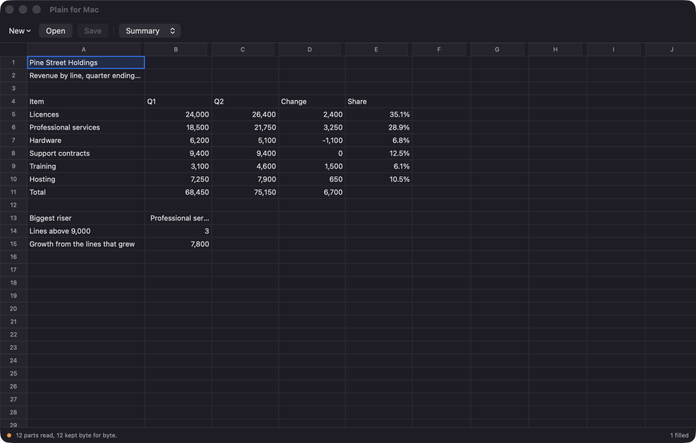
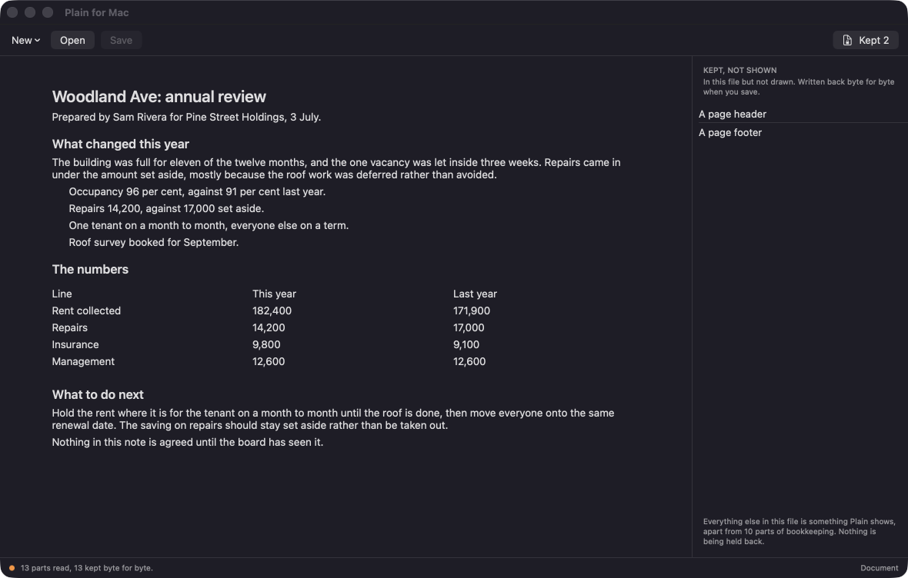

# Plain for Mac

Opens Word, Excel and PowerPoint files. Edits the things you actually change. Never damages the rest.

## Download

**[Download Plain-for-Mac-1.0.0.dmg](https://github.com/keithadler/plainmac/releases/latest/download/Plain-for-Mac-1.0.0.dmg)** (macOS 14 or later, Apple Silicon and Intel)

Open the DMG, drag the app to Applications, open it. The first time, macOS says the app is from an unidentified
developer: right-click the app, choose Open, then Open again. That is once.

It needs no permissions. It reads and writes the files you open, and nothing else.



## The promise

Every editor that opens a `.docx` reads it into its own idea of a document and writes that idea back out. Whatever
it has no room for is quietly gone: the chart, the macro, the tracked changes, the header nobody looked at. You
change three words and hand back something subtly different.

Plain opens the file as the package of parts it really is, and writes back every part it did not edit as the exact
bytes it found.

> **Open a file, save it without changing anything, and you get the same file back, byte for byte.**

That is not a claim a README can make. It is one a test can check, and it runs on every build. Check it on your own
documents:

```
plainmac roundtrip ~/Documents/*.docx ~/Documents/*.xlsx
```

The line at the bottom of the window counts it every time you save: *12 parts read, 6 kept byte for byte.*

## The same engine as Plain for Windows

This app does not have its own idea of what a `.docx` is. The part that understands the file format is the same
code that [Plain for Windows](https://github.com/keithadler/plainwin) runs, compiled ahead of time into a native
library the app links. Nothing of .NET ships in the app and there is no runtime to install.

That means the two programs agree by construction rather than by intention, and it means this app runs the engine's
own thousand checks from inside itself:

```
plainmac selftest
```

A bug found on one is fixed for both. The heading detection in this repo's first week was exactly that: a document
written by LibreOffice showed every heading as a bullet, on both platforms, and the fix went to both.

## What it does

**Spreadsheets.** Cells, text and formulas across every sheet, at the widths the file asks for, with joined cells
drawn as one. Sort, take out rows that say the same thing, split a column. Insert and delete rows and columns, and
every formula in the workbook is rewritten so it still means what it meant. Colour, alignment, wrapping, borders,
number formats, bold. Column widths and row heights. Freeze rows and columns. Add, rename, move and remove sheets,
with every formula that named a renamed sheet following it. Ask any cell what it reads and what reads it. What the
selection adds up to is on the status line, and what is already in the column is offered as you type.

**Documents.** Headings, paragraphs, lists and tables, laid out as what they are, with rows you can add and remove.
Page headers and footers. Links you can follow, edit or create. Comments and tracked changes. Pictures you can put
in and describe.

**Presentations.** The text on every slide, the speaker notes that travel with every copy and that nobody sees on
the slide, and slides you can add, remove and reorder.

**All three.** Undo and redo. Find, and find and replace. Search a whole folder. Compare two versions. Save as PDF
with page setup, or as CSV. Document properties. A list of what the file would carry with it if you sent it. And
the promise, checkable from the menu on whatever you have open.

**The keyboard does what a spreadsheet's keyboard does.** Arrows move; Command with an arrow goes to the end of the
run of filled cells or across a gap to the next thing; Home and End go to the corners; typing starts editing.



## What it keeps but does not show

Charts, pivot tables, macros, SmartArt, embedded objects, slide layouts, masters, themes, footnotes, headers and
footers. All of it is in the saved file unchanged, and the rail down the side names it in plain words rather than
by where it lives in the package.

## Honest limits

- **No page layout.** Matching Word's pagination needs Word's own fonts and line breaking. Plain shows a document
  as one scrolling column and says so.
- **It does not draw shapes, charts or pictures in place.** They are kept and listed.
- **It has never been opened in Microsoft Office.** Everything is checked against LibreOffice, against macOS's own
  PDF engine, and against the byte-for-byte round trip.
- **Not a replacement for Office.** It is what to reach for when you need to change three words in a contract
  without a four gigabyte install.

## Privacy

No account, no telemetry, no analytics. Nothing about you or your files leaves the Mac.

The one network request is a daily check with GitHub for a newer version, which sends no identifier and nothing
about your files, and which you can turn off in Settings. See [PRIVACY.md](PRIVACY.md).

## Command line

`plainmac` is the same program without a window. The app installs it, or run it out of the bundle.

```
plainmac info <file>              what it is, and what Plain keeps untouched
plainmac text <file>              the text, as plain text
plainmac cells <file> [--sheet]   every filled cell
plainmac slides <file>            the text on each slide, and the notes with it
plainmac set <file> <ref> <value> change one cell, then save
plainmac hidden <file>            what this file would carry with it
plainmac preserved <file>         the parts Plain keeps but will not draw
plainmac roundtrip <file>...      prove that a save changes nothing
plainmac do <op> [--name value]   any of the thirty operations, for scripts
plainmac selftest
plainmac version
plainmac help
```

Exit codes: 0 fine, 1 something to look at, 2 problem, 64 usage.

## Building it yourself

```
engine/build.sh both        # the engine, from the same C# as Plain for Windows (needs .NET 9)
./build-app.sh              # the app, universal
.build/release/Plain selftest
```

`build-app.sh` builds the engine for you. The engine's source is vendored in `engine/Plain.Core`, and
`tests/engine-sync.sh` checks it has not drifted from the Windows repo.

Free, MIT, built by Keith Adler. More at [keithadler.github.io](https://keithadler.github.io/).
